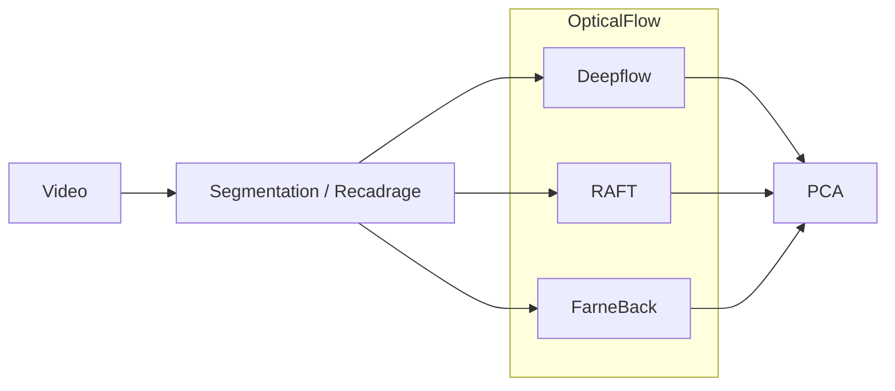

# ai4industry

Link to Sintel database leaderboard : http://sintel.is.tue.mpg.de/results

Pipeline ? 

## Étapes de Réalisation

### 1. Analyse des Flux Optiques
L'idée de départ était d'analyser les flux optiques pour extraire les mouvements des vidéos afin d'analyser ceux-ci.

### 2. Test de Plusieurs Modèles
Nous avons testé plusieurs modèles pour identifier le modèle le plus adapté à notre analyse. Pour cela, nous avons utilisé le classement Sintel pour évaluer les performances des différents modèles.

### 3. Problème avec le Modèle RAFT
Nous avons rencontré un problème avec le modèle RAFT, qui n'acceptait pas les vidéos en entrée.

### 4. Prétraitement de la Vidéo
Pour contourner ce problème, nous avons effectué un prétraitement de la vidéo en la fragmentant frame par frame.

### 5. Problème de Bruit sur les Résultats
Après la fragmentation, nous avons constaté un problème de bruit dans les résultats. Ce bruit était dû à une lumière non synchrone avec l'échantillonnage de la caméra ainsi qu'à des réflexions du cadre métalique.

### 6. Découpage de la Vidéo
Pour résoudre ce problème de bruit, nous avons effectué un découpage du superflux, en retirant tout ce qu'il y avais autour de la souris,s permettant de ne garder que l'intéréssant, la souris.

### 7. Analyse des Résultats
Enfin, nous avons effectué une analyse PCA sur les résultats frame par frame pour obtenir des insights précis sur les mouvements.

## Conclusion